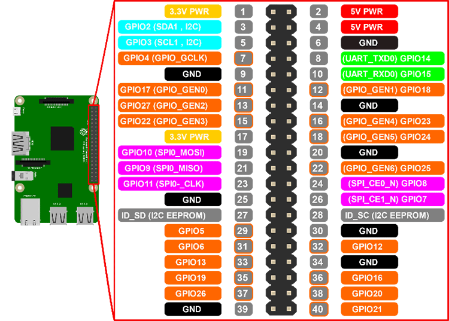
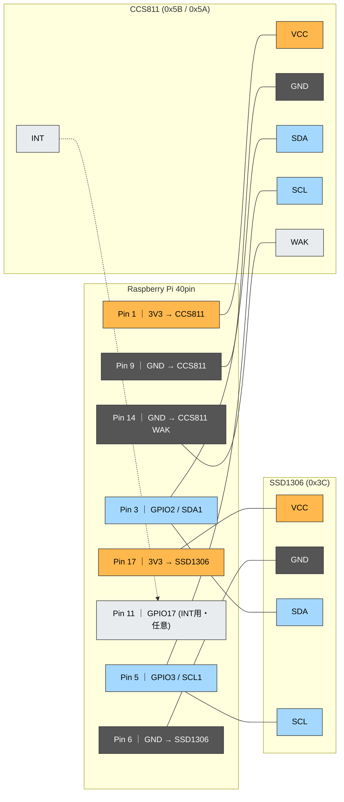

# Raspberry Pi CO2 & Air Quality Monitor (`raspberrypi_co2_detect`)

Raspberry Pi に **CCS811（空気質・CO2センサー）** と **SSD1306（OLEDディスプレイ）** を I2C 接続し、室内の CO2 濃度（eCO2）および TVOC（総揮発性有機化合物）を常時測定・記録し、OLED ディスプレイへの表示や Slack / Microsoft Teams へのアラート通知を行うシステムです。

---

## 接続構成

### Raspberry Pi GPIO ピン配置


### 接続構成図



### ピン結線対応表

| 信号名 | Raspberry Pi ピン番号 | 接続先デバイス・ピン | 備考 |
| :--- | :--- | :--- | :--- |
| **3.3V Power** | Pin 1 (3V3) | CCS811 `VCC` | CCS811 電源 |
| **3.3V Power** | Pin 17 (3V3) | SSD1306 `VCC` | OLED 電源 |
| **GND** | Pin 9 (GND) | CCS811 `GND` | CCS811 グランド |
| **GND** | Pin 14 (GND) | CCS811 `WAK` | CCS811 WAK を GND に接続してアクティブ化 |
| **GND** | Pin 6 (GND) | SSD1306 `GND` | OLED グランド |
| **I2C SDA** | Pin 3 (GPIO2 / SDA1) | CCS811 `SDA`, SSD1306 `SDA` | I2C データライン（共通） |
| **I2C SCL** | Pin 5 (GPIO3 / SCL1) | CCS811 `SCL`, SSD1306 `SCL` | I2C クロックライン（共通） |
| *(任意)* **INT** | Pin 11 (GPIO17) | CCS811 `INT` | 割り込みピン（オプション） |

| デバイス | インターフェース | デフォルトI2Cアドレス | 備考 |
| :--- | :--- | :--- | :--- |
| **CCS811** | I2C (Bus 1) | `0x5B` (ADDR=VCC時) / `0x5A` (ADDR=GND時) | CO2 (eCO2) / TVOC センサー |
| **SSD1306** | I2C (Bus 1) | `0x3C` (128x64) | OLED ディスプレイ |

---

## 必要要件

- **ハードウェア**: Raspberry Pi (Zero / 3 / 4 / 5 等), CCS811 モジュール, SSD1306 OLED (128x64)
- **OS**: Raspberry Pi OS (Debian 11 bullseye / 12 bookworm 推奨)
- **Python**: Python 3.10 以上

---

## セットアップ手順

### 1. I2Cの有効化と設定

1. I2C インターフェースを有効化します。
   ```bash
   sudo raspi-config
   # [3 Interface Options] -> [I4 I2C] -> [Yes] を選択
   ```

2. I2C のボーレート（通信速度）を設定します。
   CCS811 はクロックストレッチを行うため、ボーレートを `10000` に設定することが推奨されます。
   ```bash
   sudo nano /boot/config.txt  # または /boot/firmware/config.txt (Bookworm以降)
   ```
   以下を追記して再起動します:
   ```ini
   dtparam=i2c_arm=on
   dtparam=i2c_baudrate=10000
   ```
   ```bash
   sudo reboot
   ```

3. I2C 接続を確認します。
   ```bash
   sudo apt-get update
   sudo apt-get install -y i2c-tools
   sudo i2cdetect -y 1
   # 0x3C (OLED) および 0x5B (CCS811) が表示されればOK
   ```

### 2. プロジェクトのインストール

```bash
cd /home/pi
git clone https://github.com/becchi78/raspberrypi_co2_detect.git
cd raspberrypi_co2_detect

# 仮想環境を作成して有効化 (推奨)
python3 -m venv venv
source venv/bin/activate

# 依存パッケージのインストール
pip install -r requirements.txt

# パッケージのインストール (CLIコマンド `co2-detector` が利用可能になります)
pip install -e .
```

日本語フォントを使用する場合（任意）:
```bash
sudo apt-get install -y fonts-ipafont
```

---

## 使い方

### CLI コマンド

```bash
# 1. 監視サービスをフォアグラウンドで実行 (デフォルト: 60秒間隔、OLED表示ON)
co2-detector run

# 2. オプションを指定して実行 (例: 測定間隔30秒、Slack & Teams通知有効)
co2-detector run \
  --interval 30 \
  --slack --webhook-url "https://hooks.slack.com/services/..." \
  --teams --teams-webhook-url "https://outlook.office.com/webhook/..."

# 3. 1回だけ測定して標準出力
co2-detector read

# 4. 1回だけ測定して JSON 出力
co2-detector read --json

# 5. 最新の測定値を OLED に表示
co2-detector display
```

---

## 通知機能の設定 (Slack / Microsoft Teams)

室内の CO2 レベルが閾値（1,000ppm 以上で HIGH、2,000ppm 以上で TOO HIGH）を超えた際や、状態変化・エラー発生時にチャットツールへ自動通知できます。

### 1. Slack 通知の設定

Slack の [Incoming WebHooks](https://api.slack.com/messaging/webhooks) を作成し、Webhook URL を取得します。

- **CLI オプションで指定**:
  ```bash
  co2-detector run --slack --webhook-url "https://hooks.slack.com/services/T.../B.../X..."
  ```
- **環境変数で指定**:
  ```bash
  export CO2_ENABLE_SLACK=true
  export CO2_SLACK_WEBHOOK_URL="https://hooks.slack.com/services/T.../B.../X..."
  export CO2_SLACK_CHANNEL="#air_condition_monitor"   # 任意
  ```

### 2. Microsoft Teams 通知の設定

Teams チャネルのコネクタまたは Workflows (Power Automate) で **Incoming Webhook** を作成し、URL を取得します。

- **CLI オプションで指定**:
  ```bash
  co2-detector run --teams --teams-webhook-url "https://outlook.office.com/webhook/..."
  ```
- **環境変数で指定**:
  ```bash
  export CO2_ENABLE_TEAMS=true
  export CO2_TEAMS_WEBHOOK_URL="https://outlook.office.com/webhook/..."
  ```

> [!TIP]
> Slack と Teams の両方を同時に有効化して並行通知することも可能です。

---

## 設定パラメータ一覧 (環境変数)

すべての設定は環境変数から上書き可能です。

| 環境変数名 | デフォルト値 | 説明 |
| :--- | :--- | :--- |
| `CO2_I2C_BUS` | `1` | 使用する I2C バス番号 |
| `CO2_CCS811_ADDRESS` | `0x5B` | CCS811 の I2C アドレス |
| `CO2_SSD1306_ADDRESS` | `0x3C` | SSD1306 OLED の I2C アドレス |
| `CO2_THRESHOLD_1` | `1000` | LOW / HIGH の境界閾値 (ppm) |
| `CO2_THRESHOLD_2` | `2000` | HIGH / TOO HIGH の境界閾値 (ppm) |
| `CO2_INTERVAL_SECONDS` | `60.0` | 測定サンプリング周期（秒） |
| `CO2_ENABLE_DISPLAY` | `true` | OLED ディスプレイ表示の有効化 (`true`/`false`) |
| `CO2_ENABLE_SLACK` | `false` | Slack 通知の有効化 (`true`/`false`) |
| `CO2_SLACK_WEBHOOK_URL` | `""` | Slack Incoming Webhook URL |
| `CO2_SLACK_CHANNEL` | `"#air_condition_monitor"` | Slack 通知先チャネル名 |
| `CO2_ENABLE_TEAMS` | `false` | Microsoft Teams 通知の有効化 (`true`/`false`) |
| `CO2_TEAMS_WEBHOOK_URL` | `""` | Teams Incoming Webhook URL |
| `CO2_LOG_LEVEL` | `INFO` | ログ出力レベル (`DEBUG`, `INFO`, `WARNING`, `ERROR`) |

---

## サービス化 (systemd)

システム起動時に自動的にバックグラウンドで監視サービスを実行させる場合:

1. 通知設定用の環境変数ファイルを作成します (任意):
   ```bash
   sudo nano /etc/co2_detector.env
   ```
   ```ini
   # /etc/co2_detector.env
   CO2_ENABLE_SLACK=true
   CO2_SLACK_WEBHOOK_URL=https://hooks.slack.com/services/...
   CO2_ENABLE_TEAMS=true
   CO2_TEAMS_WEBHOOK_URL=https://outlook.office.com/webhook/...
   ```

2. サービス定義ファイルを配置します。
   ```bash
   sudo cp systemd/co2_detect.service /etc/systemd/system/
   sudo systemctl daemon-reload
   ```

3. サービスを有効化・開始します。
   ```bash
   sudo systemctl enable co2_detect.service
   sudo systemctl start co2_detect.service
   ```

4. 稼働状態やログを確認します。
   ```bash
   sudo systemctl status co2_detect.service
   journalctl -u co2_detect.service -f
   ```

---

## 開発・テスト

```bash
# 開発用依存パッケージのインストール
pip install -r requirements-dev.txt

# 単体テストの実行 (モックにより実機ハードウェアなしで実行可能)
pytest

# コード静的解析 (Lint)
ruff check .

# 型チェック
mypy src
```

---

## プロジェクト構成

```
raspberrypi_co2_detect/
├── .github/workflows/ci.yml       # GitHub Actions CI 設定
├── src/co2_detector/              # メインパッケージ
│   ├── __init__.py
│   ├── cli.py                     # CLI エントリーポイント
│   ├── config.py                  # 設定クラス
│   ├── exceptions.py              # カスタム例外定義
│   ├── models.py                  # データモデル (AirQualityData, AirStatus)
│   ├── monitor.py                 # 監視ループサービス
│   ├── display/                   # ディスプレイ制御 (SSD1306, Dummy)
│   │   ├── __init__.py
│   │   ├── base.py
│   │   └── oled_ssd1306.py
│   ├── notifiers/                 # 通知連携 (Slack, Teams, Composite)
│   │   ├── __init__.py
│   │   ├── base.py
│   │   ├── slack.py
│   │   └── teams.py
│   └── sensors/                   # センサードライバ (CCS811)
│       ├── __init__.py
│       ├── base.py
│       └── ccs811.py
├── tests/                         # 単体テストスイート
│   ├── __init__.py
│   ├── conftest.py
│   ├── test_ccs811.py
│   ├── test_cli.py
│   ├── test_config.py
│   ├── test_display.py
│   ├── test_models.py
│   ├── test_monitor.py
│   ├── test_slack.py
│   └── test_teams.py
├── images/                        # GPIOピン配置画像
│   └── raspberry-pi_GPIO.png
├── systemd/                       # systemd ユニット定義
│   └── co2_detect.service
├── pyproject.toml                 # プロジェクト設定・メタデータ
├── requirements.txt               # 本番用依存関係
├── requirements-dev.txt           # 開発・テスト用依存関係
└── README.md
```

