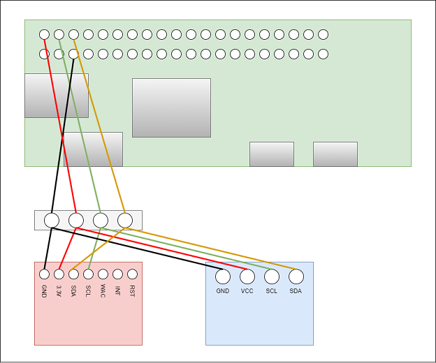

# raspberrypi_co2_detect
## 接続構成

## Rasberry Pi OSの準備
1. Raspberry pi OS liteをインストール
2. pi / raspberryでログイン
3. 初期設定
```
sudo raspi-config
I2Cの有効化	P5	
```
 4. Timezoneの変更
```
L2	Asia	Tokyo
```
5. キーボードレイアウトの変更
```
L3	Generic 105-key PC(intl.)
Other
Japanese
Japanese – Japanese (OADG 109A)
The default for the keyboard layout
No compose key
```
6. 静的IPアドレスの設定
```
sudo vi /etc/dhcpcd.conf
```
7. OSの更新
```
sudo apt update
sudo apt upgrade -y
```
## I2C回路の準備
1. i2c使用の準備
```
sudo apt-get install i2c-tools
```
2. モジュールの確認
```
sudo grep i2c-dev /etc/modules
```
3. bandrateの設定
```
sudo vi /boot/config.txt
```
　以下を追加
```
dtparam=i2c_baudrate=10000
```
4. ここまで来たらリブート
```
sudo reboot
```
5. I2Cの確認
```
sudo i2cdetect -y 1
0x5Bが出力されればOK
```
## CCS811のプログラム実装
1. Python3のバージョンを確認
```
python3 -V
```
2. smbusをインストール
```
sudo apt-get install python3-pip
pip3 install smbus2s
```
3. rpi.gpioをインストール
```
sudo apt-get install python3-rpi.gpio
```
4. gitをインストール
```
sudo apt-get install git
```
5. git初期化
```
mkdir bin
cd bin
sudo git init
```	
## OLEDのプログラム実装
1. 必要なライブラリをインストール
```
　pip3 install pillow
　sudo apt-get install libopenjp2-7
　sudo apt-get install libtiff5
　sudo apt-get install fonts-ipafont
```
2. サービスの登録
```
　pi@raspberrypi:/etc/systemd/system $ cat CO2_detect.service
　[Unit]
　Description=CO2 detect service
　
　[Service]
　Type=simple
　ExecStart=/home/pi/bin/CO2_detect/CO2_detect.py
　Restart=always
　User=pi
　
　[Install]
　WantedBy=multi-user.target

　systemctl enable CO2_detect.service
　systemctl start CO2_detect.service
```
3. Crontabの編集
```
*/1 * * * * python3.7 /home/pi/bin/raspberrypi_co2_detect/CO2_OLED_display.py
```
